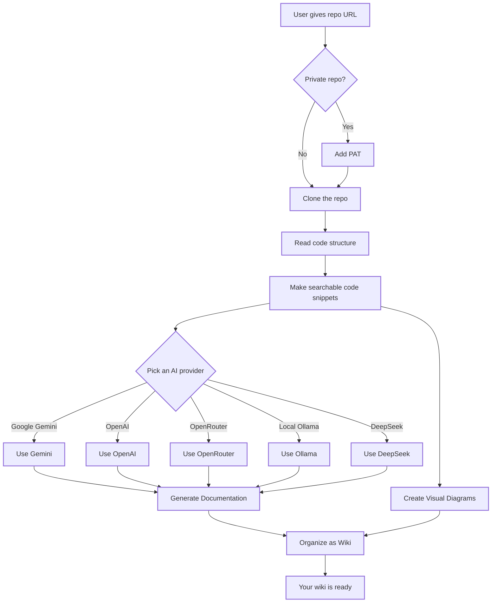

# DeepWiki-Open


## Why This Project

DeepWiki started as a fork but became much more. What began as small fixes turned into something completely different:

**Key Improvements**
- **Background Jobs**: Your generation won't stop if you close the browser. It keeps running in the background and saves progress for each page. If it stops, it picks up where it left off.
- **Data Storage**: Pages get saved as you generate them, so you won't lose work if your browser crashes or the connection drops.
- **Live Progress**: Watch your wiki being made in real-time with a simple dashboard.

**Better User Experience**
- **Modern UI**: Next.js 15 with React 19, Tailwind CSS 4, and glassmorphism design.
- **Works great on phones and tablets**
- **Cleaner design throughout**
- **Support for many AI providers**: Google Gemini, OpenAI, DeepSeek, OpenRouter, Azure OpenAI, Ollama.

**More Stuff You Can Do**
- **Use different embedding models**: OpenAI, Google, Azure OpenAI, OpenRouter, or local Ollama.
- **Support for Azure DevOps**: Works with GitHub, GitLab, Bitbucket, and Azure DevOps.
- **Flexible setup for big companies**

This is a real-world version that solves actual problems: generate docs for huge projects without worrying about your browser crashing, see exactly what's happening, and pick which AI provider you want to use.

---

**DeepWiki** turns any GitHub, GitLab, Bitbucket, or Azure DevOps repository into a searchable wiki automatically! Just give it a repo URL and it will:

1. Look at your code structure
2. Write documentation
3. Make diagrams showing how everything connects
4. Organize it all into an easy-to-navigate wiki

## ✨ What You Get

- **Quick Docs**: Turn any GitHub, GitLab, BitBucket or Azure repo into a wiki in seconds
- **Private Repos**: Use your personal access token to access private repositories
- **Smart Code Reading**: AI understands your code and how it fits together
- **Auto Diagrams**: Get Mermaid diagrams that show how your code works
- **Easy Search**: Simple way to find and read your documentation
- **Chat With Your Code**: Ask questions and get answers about your repository using RAG with HTTP streaming
- **Deep Research**: Ask complex questions and get thorough answers that look at multiple parts of your code (multi-step reasoning)
- **Pick Your AI**: Choose between Google Gemini, OpenAI, DeepSeek, OpenRouter, Azure OpenAI, or run models locally
- **Flexible Embeddings**: Use OpenAI, Google, Azure OpenAI, OpenRouter, or local models for finding similar code

## 🚀 Quick Start

### Option 1: Using Docker

```bash
# Get the code
git clone https://github.com/viettdann/deepwiki-open.git
cd deepwiki-open

# Copy the example settings file
cp .env.example .env

# Add your API keys to .env
# You need at least one of: GOOGLE_API_KEY, OPENAI_API_KEY, OPENROUTER_API_KEY, DEEPSEEK_API_KEY, AZURE_OPENAI_API_KEY, or local Ollama
# The app will close if no keys are set up
# See .env.example for all options

# Run it with Docker
docker compose up
```
Disclaimer: I don't use Ollama, do it by yourself

> 💡 **Where to get your keys:**
>
> - Google API key: [Google AI Studio](https://makersuite.google.com/app/apikey)
> - OpenAI API key: [OpenAI Platform](https://platform.openai.com/api-keys)
> - OpenRouter API key: [OpenRouter](https://openrouter.ai/)
> - DeepSeek API key: [DeepSeek Platform](https://platform.deepseek.com/api_keys)
> - Azure OpenAI key + endpoint: [Azure AI Foundry](https://ai.azure.com/)

### Option 2: Manual Setup

#### Step 1: Set Up Your API Keys

Create a `.env` file:

```bash
cp .env.example .env
# Edit .env and add your keys
```

#### Step 2: Start the Backend

```bash
# Install Python stuff
# Make sure you have uv installed (curl -LsSf https://astral.sh/uv/install.sh | sh)
cd api
uv venv
source .venv/bin/activate
uv sync

# Start the API
uv run python -m api.main
```

#### Step 3: Start the Frontend

```bash
# Install JavaScript packages
yarn install

# Start the app
yarn dev
```

#### Step 4: Use It!

1. Open [http://localhost:3000](http://localhost:3000)
2. Enter a repo like `https://github.com/openai/codex` or `https://gitlab.com/gitlab-org/gitlab`
3. For private repos, add your access token
4. Click "Generate Wiki" and watch it work!

## 🔍 How It Works

DeepWiki uses AI to:

1. Clone your repository (including private ones with tokens)
2. Create searchable code embeddings
3. Write documentation using AI (Google, OpenAI, DeepSeek, OpenRouter, or Ollama)
4. Create diagrams to explain how things connect
5. Build a structured wiki you can search
6. Let you ask questions about your code
7. Do deep research on complex topics



## 🛠️ Project Structure

```
deepwiki/
├── api/                  # Backend API server (FastAPI)
│   ├── main.py           # API entry point
│   ├── api.py            # FastAPI implementation
│   ├── rag.py            # Retrieval Augmented Generation
│   ├── data_pipeline.py  # Data processing utilities
│   ├── simple_chat.py    # HTTP streaming chat endpoint
│   ├── background/       # Background job system
│   └── pyproject.toml    # Python packages
│
├── src/                  # Frontend Next.js app
│   ├── app/              # Next.js App Router
│   │   └── page.tsx      # Main application page
│   ├── components/       # React components
│   │   └── Mermaid.tsx   # Mermaid diagram renderer
│   ├── utils/            # Utilities (streaming, API client)
│   └── public/           # Static assets
│
├── public/               # Static assets
├── package.json          # JavaScript dependencies
└── .env                  # Environment variables (create this)
```

## 🔄 Background Job System

DeepWiki includes a robust background job system for long-running wiki generation tasks:

### Features
- **Asynchronous Processing**: Wiki generation runs in the background, allowing you to track progress without blocking
- **Multi-Phase Workflow**:
  1. **Phase 0**: Prepare embeddings (0-10% progress)
  2. **Phase 1**: Generate wiki structure from repository analysis (10-50% progress)
  3. **Phase 2**: Generate individual page content with RAG (50-100% progress)
- **Per-Page Checkpointing**: If processing is interrupted, it resumes from the last completed page
- **Job Tracking**: Monitor active generation jobs via the jobs dashboard at `/jobs`
- **Progress Updates**: Real-time progress notifications with page generation details via HTTP streaming
- **Error Handling**: Automatic retry mechanism (up to 3 attempts per page) for transient failures
- **Graceful Shutdown**: Pause/resume/cancel jobs at any time

### Accessing the Jobs Dashboard
Navigate to `http://localhost:3000/jobs` to:
- View all active and completed wiki generation jobs
- Monitor progress per phase and page
- See detailed statistics (completed pages, failed pages, generation time)
- Access completed wikis from the job detail view

### Implementation Details
The background job system uses:
- **SQLite async database** (`api/background/database.py`) for job persistence
- **WikiGenerationWorker** (`api/background/worker.py`) - single async worker processing jobs sequentially
- **Job API** (`api/routes/jobs.py`) - REST endpoints for job management
- **HTTP Streaming** - real-time progress updates to connected clients (replaced WebSocket)

This system handles large repositories efficiently by processing pages concurrently with timeout protection (10 minutes max per page, 5 minutes max for LLM generation).


## 🤖 Provider-Based Model Selection System

DeepWiki lets you use different AI providers:

### What's Available

- **Google**: Default is `gemini-2.5-flash`, also has `gemini-2.5-flash-lite`, `gemini-2.5-pro`
- **OpenAI**: Default is `gpt-5-nano`, also `gpt-5`, `gpt-4o`
- **OpenRouter**: Tons of models from OpenAI, Claude, Llama, Mistral, etc.
- **DeepSeek**: Default `deepseek-chat`, also `deepseek-reasoner`
- **Ollama**: Run local models like `llama3`, `qwen3`

### Environment Variables

Add these to your `.env`:

```bash
# Your API keys (pick at least one)
GOOGLE_API_KEY=your_key
OPENAI_API_KEY=your_key
OPENROUTER_API_KEY=your_key
DEEPSEEK_API_KEY=your_key

# Optional: Use a different API endpoint
OPENAI_BASE_URL=https://custom-endpoint.com/v1
OPENROUTER_BASE_URL=https://openrouter.ai/api/v1
DEEPSEEK_BASE_URL=https://api.deepseek.com

# For local models
OLLAMA_HOST=http://localhost:11434
```

### Config Files

DeepWiki uses JSON files to set up models:

1. **`generator.json`**: Configuration for text generation models
   - Available models and providers
   - Default models
   - Temperature, top_p, top_k and other settings

2. **`embedder.json`**: Configuration for embedding models and text processing
   - Which embedding model to use for vector stor
   - How to split up text
   - Specifies text splitter settings for document chunki

3. **`repo.json`**: How to handle repositories
   - Which files to skip
   - Size limits

These are in `api/config/` by default. Change it with `DEEPWIKI_CONFIG_DIR` environment variable.

### Custom Model Selection for Service Providers

The custom model selection feature is specifically designed for service providers who need to:

- You can offer multiple AI model choices to users within your organization
- You can quickly adapt to the rapidly evolving LLM landscape without code changes
- You can support specialized or fine-tuned models that aren't in the predefined list

Service providers can implement their model offerings by selecting from the predefined options or entering custom model identifiers in the frontend interface.

### Base URL Configuration for Custom Endpoints

DeepWiki supports custom API endpoints through flexible base URL configuration:

**Environment Variables:**
- `OPENAI_BASE_URL`: Universal alias - can be used by any OpenAI-compatible client
- `OPENROUTER_BASE_URL`: OpenRouter-specific endpoint (falls back to `OPENAI_BASE_URL`)
- `DEEPSEEK_BASE_URL`: DeepSeek-specific endpoint (falls back to `OPENAI_BASE_URL`)

**Use Cases:**
- Connect to private or enterprise-specific API endpoints
- Use self-hosted or custom-deployed LLM services
- Route traffic through proxy servers
- Access special DeepSeek endpoints (reasoning, etc.)
- Point OpenAI clients to OpenRouter by setting `OPENAI_BASE_URL=https://openrouter.ai/api/v1`
- Configure OpenAI-compatible embedders (using `OPENAI_BASE_URL` with `DEEPWIKI_EMBEDDER_TYPE=openai`)

**Priority Order:**
1. Provider-specific URL (e.g., `DEEPSEEK_BASE_URL`)
2. Universal alias (`OPENAI_BASE_URL`)
3. Default endpoint for the provider

## 🧠 Using Google Embeddings

DeepWiki can use Google's embedding model instead of OpenAI. Great if you're already using Google Gemini.

### Features

- **Latest Model**: Uses Google's `text-embedding-004` model
- **Same API Key**: Uses your existing `GOOGLE_API_KEY`
- **Works Better With Gemini**: Same company, works better together
- **Handles Different Tasks**: Supports semantic similarity, retrieval, and classification tasks

### How to Enable Google AI Embeddings

**Option 1: In .env (Recommended)**

```bash
GOOGLE_API_KEY=your_key
DEEPWIKI_EMBEDDER_TYPE=google
```

**Option 2: Docker**

```bash
docker run -p 8001:8001 -p 3000:3000 \
  -e GOOGLE_API_KEY=your_key \
  -e DEEPWIKI_EMBEDDER_TYPE=google \
  -v ~/.adalflow:/root/.adalflow \
  ghcr.io/viettdann/deepwiki-open:latest
```

**Option 3: Docker Compose**

Add to `.env`:

```bash
GOOGLE_API_KEY=your_key
DEEPWIKI_EMBEDDER_TYPE=google
```

Then run:

```bash
docker compose up
```

### Available Embedder Types

| Type     | Description                 | API Key Required | Notes                               |
| -------- | --------------------------- | ---------------- | ----------------------------------- |
| `openai` | OpenAI embeddings (default) | `OPENAI_API_KEY` | Uses `text-embedding-3-small` model |
| `google` | Google AI embeddings        | `GOOGLE_API_KEY` | Uses `text-embedding-004` model     |
| `azure`  | Azure OpenAI embeddings     | `AZURE_OPENAI_API_KEY` | Deployment-based, uses `AZURE_OPENAI_VERSION` |
| `ollama` | Local Ollama embeddings     | None             | Requires local Ollama installation  |
| `openrouter` | OpenRouter embeddings   | `OPENROUTER_API_KEY` | Supports multiple models          |

### Why Use Google AI Embeddings?

- **Consistency**: If you're using Google Gemini for text generation, using Google embeddings provides better semantic consistency
- **Performance**: Google's latest embedding model offers excellent performance for retrieval tasks
- **Cost**: Competitive pricing compared to OpenAI
- **No Additional Setup**: Uses the same API key as your text generation models

### Switching Between Embedders


```bash
# Use OpenAI (default)
export DEEPWIKI_EMBEDDER_TYPE=openai

# Use Google
export DEEPWIKI_EMBEDDER_TYPE=google

# Use local Ollama
export DEEPWIKI_EMBEDDER_TYPE=ollama

# Use OpenRouter
export DEEPWIKI_EMBEDDER_TYPE=openrouter
export OPENROUTER_EMBEDDING_MODEL=openai/text-embedding-3-small

# Use Azure OpenAI
export AZURE_OPENAI_API_KEY=your_key
export AZURE_OPENAI_ENDPOINT=https://YOUR-RESOURCE.openai.azure.com
export DEEPWIKI_EMBEDDER_TYPE=azure
```

**Available OpenRouter Embedding Models:**

- `openai/text-embedding-3-small` - Default, balanced performance
- `openai/text-embedding-3-large` - Highest capability for English and non-English
- `google/gemini-embedding-001` - Unified experience across domains (science, legal, finance, coding)
- `mistralai/mistral-embed-2312` - Optimized for semantic search/RAG (1024-dim vectors)
- `qwen/qwen3-embedding-0.6b` - Lightweight multilingual model
- `qwen/qwen3-embedding-4b` - Balanced multilingual model
- `qwen/qwen3-embedding-8b` - Most capable Qwen model (32K context)

View all models: https://openrouter.ai/models?output_modalities=embeddings

**Note**:
- OpenRouter embeddings are now natively supported through `OpenRouterClient` (no need to configure `OPENAI_BASE_URL`)
- When switching embedders, you may need to regenerate your repository embeddings as different models produce different vector spaces

### Logging

DeepWiki uses Python's built-in `logging` module for diagnostic output. You can configure the verbosity and log file destination via environment variables:

| Variable        | Description                                                      | Default                    |
| --------------- | ---------------------------------------------------------------- | -------------------------- |
| `LOG_LEVEL`     | Logging level (DEBUG, INFO, WARNING, ERROR, CRITICAL).           | INFO                       |
| `LOG_FILE_PATH` | Path to the log file. If set, logs will be written to this file. | `api/logs/application.log` |
| `LOG_MAX_SIZE`  | Max log file size (in MB) before rotation                        | 10                         |
| `LOG_BACKUP_COUNT` | Number of backup log files to keep                            | 5                          |

To enable debug logging and direct logs to a custom file:

```bash
export LOG_LEVEL=DEBUG
export LOG_FILE_PATH=./debug.log
python -m api.main
```

Or with Docker:

```bash
LOG_LEVEL=DEBUG LOG_FILE_PATH=./debug.log docker-compose up
```

When running with Docker Compose, the container's `api/logs` directory is bind-mounted to `./api/logs` on your host (see the `volumes` section in `compose.yaml`), ensuring log files persist across restarts.

Alternatively, you can store these settings in your `.env` file:

```bash
LOG_LEVEL=DEBUG
LOG_FILE_PATH=./debug.log
```

Then run:

```bash
docker compose up
```

**Security note**: Make sure your log files are protected so people can't see your data.

## 🛠️ Advanced Setup

### Environment Variables

See `.env.example` for everything you can set up.

**Quick Setup:**

```bash
cp .env.example .env
# Edit it and add your keys
```

**Key Environment Variables:**

| Variable                 | Description                                               | Required      | Default                    |
| ------------------------ | --------------------------------------------------------- | ------------- | -------------------------- |
| `GOOGLE_API_KEY`         | Google Gemini API key for AI generation and embeddings    | Conditional\* | -                          |
| `OPENAI_API_KEY`         | OpenAI API key for embeddings and models                  | Conditional\* | -                          |
| `AZURE_OPENAI_API_KEY`   | Azure OpenAI API key (deployments for chat + embeddings)  | Conditional\* | -                          |
| `AZURE_OPENAI_ENDPOINT`  | Azure OpenAI endpoint (e.g., https://your-resource.openai.azure.com) | Conditional\* | - |
| `AZURE_OPENAI_VERSION`   | Azure API version (classic `api-version` or `v1`)         | Conditional\* | `v1`                       |
| `AZURE_OPENAI_USE_V1`    | Use the new `{endpoint}/openai/v1` path (skip api-version) | No            | `false`                    |
| `OPENROUTER_API_KEY`     | OpenRouter API key for alternative models                 | Conditional\* | -                          |
| `DEEPSEEK_API_KEY`       | DeepSeek API key for DeepSeek models                      | Conditional\* | -                          |
| `OPENAI_BASE_URL`        | Universal API base URL (for custom endpoints)             | No            | Provider-specific default  |
| `OPENROUTER_BASE_URL`    | OpenRouter API base URL (falls back to OPENAI_BASE_URL)  | No            | `https://openrouter.ai/api/v1` |
| `DEEPSEEK_BASE_URL`      | DeepSeek API base URL (falls back to OPENAI_BASE_URL)    | No            | `https://api.deepseek.com` |
| `DEEPWIKI_EMBEDDER_TYPE` | Embedder type: `openai`, `google`, `azure`, `ollama`, `openrouter` | No            | `openai`                   |
| `OLLAMA_HOST`            | Ollama host URL                                           | No            | `http://localhost:11434`   |
| `OPENAI_EMBEDDING_MODEL` | OpenAI embedding model name                               | No            | `text-embedding-3-large`   |
| `GOOGLE_EMBEDDING_MODEL` | Google embedding model name                               | No            | `text-embedding-004`       |
| `AZURE_OPENAI_EMBEDDING_MODEL` | Azure embedding deployment name                      | No            | `text-embedding-3-large`   |
| `OLLAMA_EMBEDDING_MODEL` | Ollama embedding model name                               | No            | `nomic-embed-text`         |
| `OPENROUTER_EMBEDDING_MODEL` | OpenRouter embedding model name                       | No            | `openai/text-embedding-3-small` |
| `PORT`                   | API server port                                           | No            | `8001`                     |
| `SERVER_BASE_URL`        | Base URL for API server                                   | No            | `http://localhost:8001`    |
| `NEXT_PUBLIC_SERVER_BASE_URL` | Frontend-accessible API URL                          | No            | `http://localhost:8001`    |
| `DEEPWIKI_AUTH_MODE`     | Enable authorization mode (`true` or `1`)                 | No            | `false`                    |
| `DEEPWIKI_AUTH_CODE`     | Authorization code (when auth mode is enabled)            | No            | -                          |
| `DEEPWIKI_API_KEY_AUTH_ENABLED` | Enable API key authentication (`true` or `1`)      | No            | `false`                    |
| `DEEPWIKI_BACKEND_API_KEYS` | Comma-separated API keys for backend access            | Conditional   | -                          |
| `DEEPWIKI_FRONTEND_API_KEY` | API key for frontend server-side requests              | Conditional   | -                          |
| `NEXT_PUBLIC_DEEPWIKI_FRONTEND_API_KEY` | API key exposed to client (use with caution) | No        | -                          |
| `DEEPWIKI_ALLOWED_ORIGINS` | Comma-separated CORS origins                            | No            | `http://localhost:3000`    |
| `DEEPWIKI_CONFIG_DIR`    | Custom configuration directory path                        | No            | `api/config/`              |
| `LOG_LEVEL`              | Logging level (DEBUG, INFO, WARNING, ERROR, CRITICAL)     | No            | `INFO`                     |
| `LOG_FILE_PATH`          | Path to log file                                          | No            | `api/logs/application.log` |
| `LOG_MAX_SIZE`           | Max log file size (MB)                                    | No            | `10`                       |
| `LOG_BACKUP_COUNT`       | Number of backup log files                                | No            | `5`                        |

*You need at least one of: `GOOGLE_API_KEY`, `OPENAI_API_KEY`, `AZURE_OPENAI_API_KEY`, `OPENROUTER_API_KEY`, `DEEPSEEK_API_KEY`, or local Ollama.

**Important**: The app stops if no keys are set up. So you'll know right away if something's missing.

For a complete list of all environment variables with detailed descriptions, see [`.env.example`](.env.example).

**API Key Requirements:**

- Using `DEEPWIKI_EMBEDDER_TYPE=openai`: Need `OPENAI_API_KEY`
- Using `DEEPWIKI_EMBEDDER_TYPE=google`: Need `GOOGLE_API_KEY`
- Using `DEEPWIKI_EMBEDDER_TYPE=azure`: Need `AZURE_OPENAI_API_KEY` + `AZURE_OPENAI_ENDPOINT`
- Using `DEEPWIKI_EMBEDDER_TYPE=ollama`: No key needed
- Using `DEEPWIKI_EMBEDDER_TYPE=openrouter`: Need `OPENROUTER_API_KEY`

Only add other keys if you're actually using those providers.

## Access Control

You can lock down who can generate wikis by turning on access codes.

Set these:

- `DEEPWIKI_AUTH_MODE`: Set to `true` or `1` to turn on access codes
- `DEEPWIKI_AUTH_CODE`: Your secret code

If you don't set `DEEPWIKI_AUTH_MODE` or set it to `false`, anyone can use it.

### Docker

#### Run a Container

```bash
# Get the image
docker pull ghcr.io/viettdann/deepwiki-open:latest

# Run it
docker run -p 8001:8001 -p 3000:3000 \
  -e GOOGLE_API_KEY=your_key \
  -e OPENAI_API_KEY=your_key \
  -e OPENROUTER_API_KEY=your_key \
  -e OLLAMA_HOST=your_host \
  -v ~/.adalflow:/root/.adalflow \
  ghcr.io/viettdann/deepwiki-open:latest
```

Data gets saved in `~/.adalflow`:
- Cloned repos: `~/.adalflow/repos/`
- Embeddings: `~/.adalflow/databases/`
- Generated wikis: `~/.adalflow/wikicache/`
This ensures that your data persists even if the container is stopped or removed.

Or use Docker Compose:

```bash
# Must set up .env first
docker compose up
```
(The `compose.yaml` file is pre-configured to mount `~/.adalflow` for data persistence, similar to the `docker run` command above.)


#### Use a .env File With Docker

```bash
echo "GOOGLE_API_KEY=your_key" > .env
echo "OPENAI_API_KEY=your_key" >> .env
echo "OPENROUTER_API_KEY=your_key" >> .env
echo "OLLAMA_HOST=your_host" >> .env

# Run the container with the .env file mounted
docker run -p 8001:8001 -p 3000:3000 \
  -v $(pwd)/.env:/app/.env \
  -v ~/.adalflow:/root/.adalflow \
  ghcr.io/viettdann/deepwiki-open:latest
```

#### Build Locally

```bash
git clone https://github.com/viettdann/deepwiki-open.git
cd deepwiki-open

docker build -t deepwiki .

docker run -p 8001:8001 -p 3000:3000 \
  -e GOOGLE_API_KEY=your_key \
  -e OPENAI_API_KEY=your_key \
  -e OPENROUTER_API_KEY=your_key \
  -e OLLAMA_HOST=your_host \
  deepwiki
```

#### Self-Signed Certificates

If your company uses special certificates:

1. Create a directory for your certificates (default is `certs` in your project root)
2. Put your `.crt` or `.pem` files in the `certs` folder
3. Build:

```bash
docker build .
# or with a custom folder
docker build --build-arg CUSTOM_CERT_DIR=my-certs .
```

### API Server

The API does:

- Repository cloning and indexing
- RAG (Retrieval Augmented Generation) - Search code and generate answers
- Stream responses back to you via HTTP streaming

See [API README](./api/README.md) for more.

## 🔌 OpenRouter Integration

[OpenRouter](https://openrouter.ai/) gives you access to hundreds of models through one API:

- **Multiple Model Options**: Access models from OpenAI, Anthropic, Google, Meta, Mistral, and more
- **Simple Configuration**: Just add your OpenRouter API key and select the model you want to use
- **Cost Efficiency**: Choose models that fit your budget and performance needs
- **Easy Switching**: Toggle between different models without changing your code

### How to Use It

1. **Get a Key**: Sign up at [OpenRouter](https://openrouter.ai/)
2. **Add to .env**: `OPENROUTER_API_KEY=your_key`
3. **Turn It On**: Check "Use OpenRouter" on the home page
4. **Pick a Model**: GPT-4o, Claude, Gemini, etc.

5. **Embeddings** (Optional)**: Set `DEEPWIKI_EMBEDDER_TYPE=openrouter` to use OpenRouter embeddings

Notes: **Yes, you can use OpenRouter for both text generation and embeddings, I've implemented support for both.**

OpenRouter is particularly useful if you want to:

- Try different models without signing up for multiple services
- Access models that might be restricted in your region
- Compare performance across different model providers
- Optimize for cost vs. performance based on your needs

## 🤖 Ask & Deep Research

### Ask

Chat with your code using RAG (finds relevant code and answers questions):

- **Gets The Right Answers**: Finds actual code to answer your question
- **Real-time Typing**: Watch the answer appear as it's being written (HTTP Streaming)
- **Remembers Context**: Keeps track of what you've asked before
- **Finds Related Code**: Shows you which parts of your code it used

### Deep Research

For harder questions, turn on "Deep Research":

- **Digs Deeper**: Looks at multiple parts of your code
- **Follows A Plan**: Shows you what it's researching
- **Keeps Going**: Does up to 5 rounds of research
- **Gives Full Answer**: Combines everything into one answer
- **How it works**:
  1. **Plan**: Creates a research plan based on your question
  2. **Investigate**: Iteratively explores the codebase, following the plan
  3. **Synthesize**: Combines findings from all steps into a final comprehensive answer

## ❓ Troubleshooting

### API Key Issues

- **"No API keys configured - Application exiting"**: The application now exits immediately if no API keys or Ollama host are configured. Add at least one API key to your `.env` file:
  - `GOOGLE_API_KEY` for Google Gemini
  - `OPENAI_API_KEY` for OpenAI
  - `OPENROUTER_API_KEY` for OpenRouter
  - `DEEPSEEK_API_KEY` for DeepSeek
  - Or set up local Ollama with `OLLAMA_HOST`
- **"Missing environment variables"**: Make sure your `.env` file is in the project root and contains the required API keys. Use `.env.example` as a reference.
- **"API key not valid"**: Check that you've copied the full key correctly with no extra spaces
- **"OpenRouter API error"**: Verify your OpenRouter API key is valid and has sufficient credits

### Can't Connect

- **"Can't reach API"**: Make sure API is running on port 8001
- **"CORS error"**: Both should be on same machine, or check CORS settings. Maybe I'll create compose file for detached FE & BE.

### Generation Issues

- **"Error generating wiki"**: For very large repositories, try a smaller one first
- **"Invalid repository format"**: Make sure you're using a valid GitHub, GitLab or Bitbucket URL format
- **"Could not fetch repository structure"**: For private repositories, ensure you've entered a valid personal access token with appropriate permissions
- **"Diagram rendering error"**: The app will automatically try to fix broken diagrams
- **"Token limit exceeded"**: If you see this during chat, the app will automatically retry with a simplified prompt (without RAG context) to fit within limits.

### Common Solutions

1. **Restart both servers**: Sometimes a simple restart fixes most issues
2. **Check console logs**: Open browser developer tools to see any JavaScript errors
3. **Check API logs**: Look at the terminal where the API is running for Python errors
